# Runbooks

**Production hosting:** AWS ECS (`koda-platform` stack). See [deploy.md](./deploy.md) and [infra/aws/README.md](../infra/aws/README.md).

Railway (`bountiful-fascination`) is **legacy** — decommission only after DNS cutover and smoke tests in [aws-migration.md](./aws-migration.md).

## Production Clerk auth (AWS)

Customers sign in via Clerk on `clerk.advancedautomations.net`. Required on **web** and **worker**:

1. Set in Secrets Manager app secret (`infra/aws/terraform/secrets.tf` defaults):
   - `OPEN_ACCESS=0`, `NEXT_PUBLIC_OPEN_ACCESS=0`
   - `ALLOW_DEMO_AUTH=0`, `NEXT_PUBLIC_ALLOW_DEMO_AUTH=0`
   - Clerk live keys + `CLERK_WEBHOOK_SECRET`
2. Rebuild and deploy the **web** image with `NEXT_PUBLIC_OPEN_ACCESS=0` (GitHub Actions or `docker build` with build-args — see [aws-deploy workflow](../.github/workflows/aws-deploy.yml)).
3. Force ECS rolling deploy for web + worker.

```bash
# After Secrets Manager update:
aws secretsmanager put-secret-value \
  --secret-id "$(terraform -chdir=infra/aws/terraform output -raw app_secrets_arn)" \
  --secret-string file://koda-app-secrets.json

# Redeploy (Actions → Deploy Koda to AWS) or:
aws ecs update-service --cluster koda-platform-production-cluster \
  --service koda-platform-production-web --force-new-deployment
aws ecs update-service --cluster koda-platform-production-cluster \
  --service koda-platform-production-worker --force-new-deployment
```

Then open https://koda.advancedautomations.net — Sign in → select organization → Programs.

**No public sign-up:** the app redirects `/sign-up` to `/sign-in` and hides registration CTAs. Also turn off **Allow sign-ups** in Clerk Dashboard → User & Authentication → Restrictions so invites/admin-created users are the only path.

Staff developer tools: sign in with Clerk `org:developer` / `org:admin`, or use `/staff` password fallback (`ADMIN_PASSWORD`).

## Local open access (no login)

```bash
cp .env.example .env
# Production-like local: OPEN_ACCESS=0 + Clerk keys in .env
# No-login local dev: OPEN_ACCESS=1, ALLOW_DEMO_AUTH=0, mocks on

# Start Postgres + Redis (docker compose or local services)
pnpm install
# postinstall runs db:generate + packages:build
pnpm db:push   # or: pnpm db:migrate
pnpm db:seed
pnpm packages:build   # only needed if dist/ is missing
pnpm dev:web
pnpm dev:worker
```

Open http://localhost:3000 — redirects to `/projects` as the seeded customer (EMPLOYEE). No Sign in / role switcher.

## Hosted open access (local dev pattern only)

> **Deprecated for production.** NetFree whitelabel allows Clerk — use production Clerk auth above.

Single-customer mode for temporary testing — use **local** `.env` (`OPEN_ACCESS=1`) only. Do not enable open access on AWS production.

### Program lifecycle (plan → build → verify → deploy)

```mermaid
stateDiagram-v2
  direction LR
  [*] --> PLANNING
  PLANNING --> AWAITING_DEV_BUILD: Customer submits plan\n(planning locks)
  AWAITING_DEV_BUILD --> BUILDING: Developer starts build
  BUILDING --> TESTING: Grant Test & Improve (optional)
  BUILDING --> CLIENT_VERIFY: Ready for client testing
  TESTING --> CLIENT_VERIFY: Ready for client testing
  CLIENT_VERIFY --> AWAITING_FINAL_REVIEW: Customer submits for final review
  AWAITING_FINAL_REVIEW --> DONE: Developer approves & deploys
  AWAITING_DEV_BUILD --> PLANNING: Staff reopens planning only
```



| Phase | Status | Customer sees |
| --- | --- | --- |
| Planning | `PLANNING` | Living plan chat, attach docs/secrets, submit modal with lock warning |
| Submitted / building | `AWAITING_DEV_BUILD`, `BUILDING`, `TESTING` | “Submitted — your developer is building. Planning is closed.” Chat composer disabled |
| Test & request changes | `CLIENT_VERIFY`, `PREVIEW_READY`, `CHANGES_REQUESTED` | New chat phase (not planning). Ask how to test, request edits. Agent edits live repo branch |
| Final review | `AWAITING_FINAL_REVIEW` | Chat closed; developer reviews in queue |
| Complete | `DONE` / `DEPLOYED` | Program complete |

Submit requires **two confirmations** plus checkbox: “I understand I cannot change the plan after submit.”
Customers cannot reopen planning — only staff (`DEVELOPER` / `ADMIN`) via Actions.

Developer flow:

1. **Open in Cursor** — review plan (plan mode)
2. **Build** — agent/build mode on branch
3. **Grant Test & Improve** (optional) — developer workspace
4. **Ready for client testing** — opens `CLIENT_VERIFY`, posts phase-break message, starts verify chat for customer
5. Customer **Submit for final review** → notify email (`NOTIFY_EMAIL`)
6. **Approve & deploy** from review queue / Build desk

### Accidental program submit / staff reopen planning

Submit requires explicit confirmation (`confirmSubmit: true`) and acknowledgment
(`confirmNoPlanChange: true`). Chat and file attach never submit a program.

Customers **cannot** reopen planning after submit. If the plan was wrong:

1. Staff unlocks at `/staff`
2. Open the program → Actions → **Reopen planning (staff)**
3. Status returns to `PLANNING` for the customer


### Customer secrets (plan prerequisites + secure paste)

Living plans include **## What you need to provide** (accounts, API keys,
logins, sample files, VPN access). Koda keeps this list updated while planning.

**Customer — add credentials**

1. Open a program in Planning
2. Click **Add secrets / credentials** under the composer
3. Enter a clear name (e.g. `HHA_PASSWORD`) and the value
4. Click **Save securely** — chat shows only `Secret saved: HHA_PASSWORD`
5. Values are AES-GCM encrypted in `secret_refs` (`ENCRYPTION_KEY`); never
   appear in chat logs, plan markdown, or SSE snapshots

Do **not** paste passwords into the normal chat box. Auto-detection still
redacts common patterns if they slip through.

**Developer — retrieve for Build**

1. Unlock staff: open `/staff`, enter `ADMIN_PASSWORD` (or `STAFF_ACCESS_TOKEN`)
2. Open the submitted program → **Build desk**
3. Under **Customer secrets**, click **Reveal** then **Copy once**
4. Use the value in the build environment / Cursor session manually
5. Never commit secrets to git or PR bodies; audit logs store key names only

Open in Cursor / Build / Test & Improve prompts include secret **names** only
(so you know what to look up). Decrypt happens only on the Build desk.

### Developer flow: Open in Cursor → Build → Test & Improve

While `OPEN_ACCESS=1`, the public site is always the seeded **EMPLOYEE**.
Developers unlock staff tools with a password (`ADMIN_PASSWORD` or
`STAFF_ACCESS_TOKEN`) via the `/staff` form — the password is never put in the
URL (query tokens leak in history and logs). After login, an httpOnly signed
cookie unlocks `/admin`, `/review`, and `/usage`.

Set `ADMIN_PASSWORD` (or `STAFF_ACCESS_TOKEN`) in Secrets Manager app secret, redeploy web, then open https://koda.advancedautomations.net/staff.

Then for each submitted program:

1. Open **Review queue** → program (or the link from the notify email)
2. Click **Open in Cursor** — resumes/creates a plan-mode agent with the
   customer's living plan and opens `cursor.com/background-agent?bcId=…`
   (falls back to `cursor.com/agents/{id}` in the browser)
3. Click **Build** (server label + auto-deploy) → status `BUILDING`, agent
   switches to agent/build mode on the plan
4. Confirm **Grant Test & Improve workspace** → status `TESTING`, workspace
   panel with Continue in Cursor + Deploy
5. Click **Ready for client testing** → status `CLIENT_VERIFY`, customer
   Test & request changes chat opens (planning stays closed)
6. Customer verifies in Koda chat only — they never see Cursor / Git / Railway
7. Customer **Submit for final review** → developer notify email

### Developer email on submit

On submit, Koda queues (and sends via Resend when configured) a notify email.

Set in Secrets Manager app secret (web service reads at runtime):

- `NOTIFY_EMAIL` — recipient while seed users use `@demo.local`
- `RESEND_API_KEY` — without it, rows stay QUEUED in Admin inbox
- `EMAIL_FROM` — e.g. `Koda <onboarding@resend.dev>` or verified domain sender

Without `RESEND_API_KEY`, notifications are stored in Admin → Notification inbox only
(use CloudWatch logs / DB / a developer session to inspect).

### Restore Clerk (if open access was re-enabled)

Update Secrets Manager (`OPEN_ACCESS=0`, `NEXT_PUBLIC_OPEN_ACCESS=0`), rebuild web image with `NEXT_PUBLIC_OPEN_ACCESS=0`, force ECS redeploy. See production Clerk auth above.

## Local demo mode (optional, role switcher)

For local explore with Employee / Developer / Admin switching, set
`ALLOW_DEMO_AUTH=1` / `NEXT_PUBLIC_ALLOW_DEMO_AUTH=1` and leave `OPEN_ACCESS=0`.
Do **not** enable demo auth on production while using open access.

## Connect a repository

1. Use Clerk admin once wired, or temporarily seed admin locally with demo auth
2. Open Admin → Install GitHub App (mock callback works without credentials)
3. Connect `owner/repo` on a project (installation id optional in mock mode)
4. Open project as customer → create a program

## Failed request recovery

- Employee/developer opens the change request
- Click **Retry** (only available in `FAILED`)
- Worker re-enters `ANALYZING` and resumes from branch creation or agent start

## High-risk workflow

1. Employee submits auth/payment/security related request
2. Status becomes `AWAITING_HIGH_RISK_APPROVAL`
3. Developer approves high-risk in Actions or Review queue
4. Implementation proceeds on an isolated branch only

## Production wiring checklist (AWS)

1. Apply Terraform per [infra/aws/README.md](../infra/aws/README.md); populate Secrets Manager
2. Enable GitHub Actions deploy (`AWS_DEPLOY_ENABLED=true`, `AWS_DEPLOY_ROLE_ARN`, Clerk publishable key secret)
3. Configure Clerk Organizations + roles (`org:employee`, `org:developer`, `org:admin`)
4. Clerk **Production** keys (`pk_live_` / `sk_live_`) on `clerk.advancedautomations.net` — see [deploy.md](./deploy.md#clerk-keys-development-vs-production)
5. Clerk webhook → `https://koda.advancedautomations.net/api/webhooks/clerk`
6. `OPEN_ACCESS=0` / `NEXT_PUBLIC_OPEN_ACCESS=0` in secret + web image build-args
7. Set `CURSOR_API_KEY`; remove `CURSOR_MOCK` from app secret
8. Register GitHub App; set `GITHUB_APP_*`; remove `GITHUB_MOCK`
9. DNS: `koda.advancedautomations.net` CNAME → ALB (`terraform output alb_dns_name`)
10. Protect `main` with required reviews + checks
11. Set company usage soft caps in Admin settings
12. `ENCRYPTION_KEY` same value on web + worker (Secrets Manager)
13. After first sign-in, open `/select-org` if prompted — Koda JIT-links org to `demo-co` when `clerkOrgId` was unset
14. Decommission Railway after cutover — [aws-migration.md](./aws-migration.md#railway-decommission)

## Scaling for production

Koda on AWS: **ECS web** (Next.js) + **ECS worker** (BullMQ) + **RDS Postgres** + **ElastiCache Redis**.

### Multi-tenant readiness

| Layer | Today (OPEN_ACCESS=1) | Many customers (OPEN_ACCESS=0) |
| --- | --- | --- |
| Identity | Seeded `seed_employee` on `demo-co` | Clerk org → `Company.clerkOrgId` |
| Data scope | All queries filter `companyId` via `requireChangeRequestAccess` | Same — each org is isolated |
| Staff routes | `/staff` password → signed cookie for `/admin`, `/review`, `/usage` | Clerk `DEVELOPER` / `ADMIN` roles |
| Secrets | AES-GCM in `secret_refs`, scoped by `companyId` | Optional `ENCRYPTION_KEY_PER_ORG=1` for per-org key derivation |

**Before launch:** set `OPEN_ACCESS=0`, verify Clerk webhook sync, confirm each customer has their own Clerk org (not shared `demo-co`). The seed company remains for local dev only.

### Recommended AWS scaling

Start conservative; scale ECS desired count before raising per-process concurrency.

| Component | Starter (≤10 active users) | Growth (10–100 users) | High load (100+) |
| --- | --- | --- | --- |
| **web** | `web_desired_count=2` | 3–4 tasks | 5+ tasks + CDN for static |
| **worker** | `worker_desired_count=1`, `WORKER_CONCURRENCY=5` | 2 tasks | 3+ tasks; tune `MAX_CONCURRENT_CURSOR_AGENTS` |
| **Postgres** | `db.t4g.small` | `db.t4g.medium`; `?connection_limit=10` on `DATABASE_URL` | Larger instance; read replicas later |
| **Redis** | `cache.t4g.small` | Monitor memory | Larger node class |

Tune in Secrets Manager app secret + `terraform.tfvars` (`web_desired_count`, `worker_desired_count`), then `terraform apply` and force ECS redeploy.

Example app-secret tuning: `WORKER_CONCURRENCY=5`, `MAX_CONCURRENT_CURSOR_AGENTS=8`, `SSE_MAX_CONNECTIONS_PER_PROGRAM=8`, `SSE_MAX_CONNECTIONS_TOTAL=500`, `RATE_LIMIT_MESSAGES_PER_MIN=30`, `RATE_LIMIT_SUBMIT_PER_MIN=10`.

### Environment flags (reference)

| Variable | Default | Purpose |
| --- | --- | --- |
| `WORKER_CONCURRENCY` | 5 | BullMQ jobs per worker replica |
| `MAX_CONCURRENT_CURSOR_AGENTS` | 8 | Global Redis semaphore — prevents Cursor API stampede |
| `QUEUE_MAX_WAITING` | 0 (unlimited) | Set e.g. 500 to reject enqueue when backlog is huge |
| `SSE_MAX_CONNECTIONS_PER_PROGRAM` | 8 | Live chat SSE tabs per program per web replica |
| `SSE_MAX_CONNECTION_AGE_MS` | 7200000 | Auto-close stale SSE (2h) |
| `RATE_LIMIT_*` | see `.env.example` | Per-user API throttles (Redis-backed) |
| `ENCRYPTION_KEY_PER_ORG` | 0 | Set `1` for per-company secret keys (re-save secrets after) |
| `STAFF_SESSION_MAX_AGE_SEC` | 28800 | Staff cookie lifetime (8h) |

Planning jobs get **higher BullMQ priority** than build jobs automatically.

### Health checks

| Endpoint | Service | Use |
| --- | --- | --- |
| `GET /api/health` | web | Liveness |
| `GET /api/ready` | web | Readiness (Postgres + Redis) |
| `GET :8081/health` | worker | Liveness (`WORKER_HEALTH_PORT`) |
| `GET :8081/ready` | worker | Queue + cursor slot stats |

ALB target group health check: `/api/ready` (stricter than `/api/health`).

### What to do before many users

1. **Turn off open access** — `OPEN_ACCESS=0`, Clerk production keys, webhook wired.
2. **Run migrations** — `pnpm db:migrate:deploy` (includes scale indexes on messages, agent_runs, programs).
3. **Set scaling env vars** on web + worker (see table above).
4. **Cap Cursor concurrency** — `MAX_CONCURRENT_CURSOR_AGENTS` ≤ your Cursor plan limits.
5. **Enable rate limits** — tune `RATE_LIMIT_*` for your expected traffic.
6. **Staff hardening** — strong `ADMIN_PASSWORD`, shorter `STAFF_SESSION_MAX_AGE_SEC`, never share password in URLs.
7. **Monitor** — worker `/ready` queue depth, RDS connections, ElastiCache memory, failed BullMQ jobs (`removeOnFail` keeps last 5000), ALB 5xx, ECS CPU.
8. **Optional per-org encryption** — `ENCRYPTION_KEY_PER_ORG=1` only after planning a secret re-save window.

### Graceful degradation under load

When Cursor slots are full or the queue is deep, customers see plain-English status in chat: *“Koda is in high demand…”* with queue position when available. Jobs dedupe per program (`jobId: cursor-start-{id}`, `cursor-follow-up-{id}`) to prevent duplicate agents.
